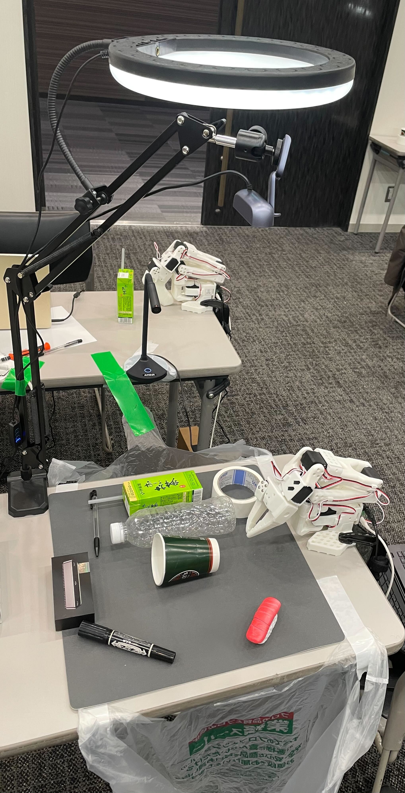

# AMD Robotics Hackathon 2025 - Project NARUTO
## Modular Waste Sorter: YOLOv11とACTモデルの連携による高精度な分別システム
(Multi-Task Robot Framework: 物体認識駆動型のタスク切り替えシステム)

---

## チーム情報 (Team Information)

| 項目 | 内容 |
| :--- | :--- |
| **Team Number** | 18 |
| **Team Name** | RAMEN |
| **Members** | Fumiaki Hara, Keisuke Otani, Y Nakamura, Masamichi Nisiwaki |

---

## 概要 (Project Overview)

SO101ロボットアームを使用し、机上に散在するごみを認識・自律的に把持し、指定のゴミ箱へ分別して廃棄するシステムを構築しました。

画像認識AI（YOLO）が対象物を瞬時に検知し、その物体の種類に応じた個別の動作モデル（ACT）を動的に呼び出すことで、複数の異なるアイテムを連続的かつ正確に処理するシステムを実現しています。

<video src="./assets/movies/ramen_amd_20251207_01.mp4" width="500" controls>
</video>

---

## 提出の詳細 (Project Details)

### 1. ミッションの説明（課題と背景）
ロボットアームを実社会で活用する際、単一の動作だけでなく、複数のアイテムを扱ったり、状況に応じて異なるタスクを連続してこなしたりする能力が求められます。

しかし、あらゆるタスクを単一の巨大なAIモデルで処理しようとすると、学習難易度が高まり、動作の精度が安定しないという課題があります。そこで本プロジェクトでは、「認識」と「動作」を切り分け、タスクごとに最適なモデルを適用する実用的なフレームワークの構築を目指しました。

### 2. 創造性（アプローチの独自性）
本システムの最大の特徴は、**「モジュラー型タスク処理」**のアプローチです。
すべての動作を一度に学習させるのではなく、タスク（例：「コップを捨てる」「ペットボトルを捨てる」）ごとに個別のACT（Action Chunking with Transformers）モデルを作成しました。

これにより、以下のメリットを生み出しています。
* **高精度化:** 1つのモデルが1つのタスクに集中するため、少ないデータ数でも高い成功率を実現。
* **柔軟なワークフロー:** プログラム側で処理順序を制御できるため、複雑な連続処理も安定して実行可能。

また、YOLOでうまく認識できるように10枚程度の写真を作成、アノテーションし、転移学習で一部の層だけ学習して認識率を上げました。

### 3. 技術的な実装
本システムは「視覚（認識）」と「身体（制御）」を明確に連携させています。

#### 画像認識とタスク管理: YOLO11
* 最新のYOLO11を用いて、ワークスペース内の物体（紙コップ、ペットボトル）をリアルタイムに検知・リスト化します。
* 検知されたクラスIDに基づき、その物体を処理するために必要な推論モデル（ポリシー）を動的にロードし、ロボットへ実行指示を出します。

#### ロボット制御: ACT (LeRobot)
* ロボットアーム（SO101）の制御には、LeRobotのガイドラインに準拠したACTのファインチューニングを採用しました。
* **データセット:** リーダーアームを用いたテレオペレーションにより収集。物体の向きや回転角度を変え、ロバスト性向上を狙いました。
* **学習規模:** 各タスクにつき20エピソード（1エピソード20秒）という軽量なデータセットで効率的に学習させています。

#### 利用機材 (equipment)

SO101、俯瞰カメラ,横からのカメラ、ライト、マット、PC

#### 推論処理フロー (Evaluation System Flow) 


### 4. 使いやすさ（拡張性と今後の展望）
本システムは拡張性を重視した設計となっており、新たな「ゴミの種類」や「捨て場所」を追加することが容易です。

#### 容易なタスク追加
* **認識:** 新規アイテムをYOLOで学習（または既存モデルで検知可能な場合）させます。
* **動作:** そのアイテム専用の動作データを収集し、ACTをファインチューニングします。
* **実装:** 設定ファイル（Config）にて、検知したIDと参照するモデルパス、タスク記述（task_text）を紐付けるだけで、プログラムを変更することなく機能拡張が可能です。

#### 現在の制約と今後の課題
現在は動作モデルの特性上、アイテムの配置場所は学習データに近い位置である必要があります。ただし、この課題は配置場所をシャッフルしたデータセットで学習することで、解決可能と考えています。

---

## ロボット制御インターフェース (Usage)

### 起動コマンド
実運用モード（Production）にて、信頼度閾値（CONF）を設定しマネージャープログラムを起動します。

```bash
CONF=0.5 RUN_MODE=production .venv/bin/python manager.py
```


Delivery URL

Cup
Dataset:https://huggingface.co/datasets/AmdRamen/mission2_record_cup
Model:https://huggingface.co/AmdRamen/mission2_cup

Bottle
Dataset:https://huggingface.co/datasets/AmdRamen/mission2_record_bottle
Excluded Dataset:https://huggingface.co/datasets/AmdRamen/mission2_record_bottle_edited
Model:https://huggingface.co/AmdRamen/mission2_bottle
